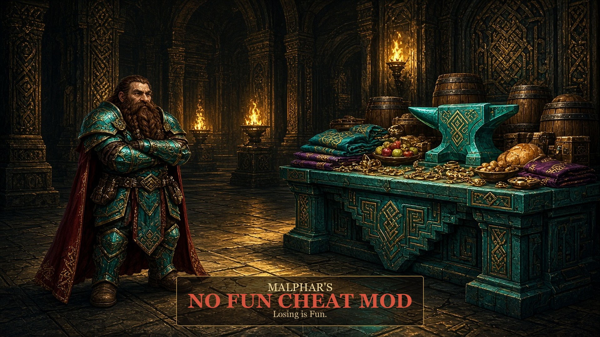

# Malphar's No Fun Cheat Mod

This was an exercise in whether this kind of mod could be made, not whether it should.

> For when you don't want to have any fun.
>
> The flooded fortress, the beast from the cavern, the werebeast you did not notice, the shortage, and the collapse are taken away. There is nothing left to lose.

| | |
|---|---|
| Game | Steam Dwarf Fortress |
| Requires | [DFHack](https://github.com/DFHack/dfhack) |
| Version | 1.5.0 |
| Source | [AlanCalhoun/games](https://github.com/AlanCalhoun/games/tree/main/Dwarf%20Fortress/malphars-no-fun-cheat-mod) |

## Install

1. Install Dwarf Fortress from Steam, with DFHack.
2. Copy this folder to `%APPDATA%\Bay 12 Games\Dwarf Fortress\mods\malphars_mod`.
3. In the game, enable **Malphar's No Fun Cheat Mod** and disable every other mod. A second copy of MultiHaul will also try to haul.
4. Generate a **new world**. God-mode dwarves, the cheat workshop, and no aquifers are baked in at world creation. An old world does not gain them.

The DFHack scripts start when the fort loads. You do not type commands.

## What it does

**Dwarves.** They do not eat, drink, sleep, or breathe. They do not feel pain, fear, stun, dizziness, fever, or exertion. They start at legendary skill in the fortress labors. Jobs finish instantly, including for migrants who arrive later. Walking speed stays the normal dwarf speed.

**Placement.** Open the build menu. The mod puts the item for that building on the tile under the cursor. Choose **Closest item**. The item is adamantine, or the highest-value material that item is allowed to be. A door still has to sit in a gap next to a wall. Walls, floors, and workshops use adamantine blocks, or raw adamantine when the building cannot be metal. Bookshelves, nest boxes, hives, altars, and display cases are placed as those exact tools. Buildings placed in a row are unsuspended.

**Ground stock.** The highest-value meat, prepared fish, cheese, and masterwork lavish meals stay in supply near your dwarves, and the best drink is kept in barrels. Animals get plump helmets, cave wheat, pig tails, sweet pods, and their seeds. Used food is replaced. The best clothes and personal items stay in supply too: shirts, cloaks, pants, shoes, gloves, hoods, caps, armor, backpacks, flasks, quivers, pouches, amulets, rings, earrings, bracelets, and crowns. Worn items do not count, so another is made when a dwarf puts one on. Soap, cloth, thread, medical supplies, mechanisms, furniture, and an army kit are there too.

**Refuse.** Animal corpses, bones, shells, skins, skulls, and vermin remains are removed. Corpses of dwarves, humans, elves, goblins, and other people are left so they can be buried.

**Hidden mining.** Loose boulders and rough gems are invisible until they are in a stockpile. They still occupy the tile, so you cannot build in that square until they are hauled.

**No aquifers.** Sand, clay, loam, silt, and ooze layers do not carry water.

**No miasma.** Plants, food, meat, and corpses are kept from rotting. Any miasma already in the fort is cleared.

**Stockpile.** Every stockpile shares one inventory. A pile next to a workshop can use the goods in any other pile. Food and drink go in barrels. Clothes, gems, bars, ammo, mined boulders, and other small goods go in bins. Anything dropped on the ground is put into the nearest pile. Refuse and corpses stay out.

**MultiHaul.** One dwarf hauls several items in one job. This needs a wheelbarrow. The mod stocks an adamantine one, and the cheat workshop can conjure more. MultiHaul is [Loire's script](https://steamcommunity.com/sharedfiles/filedetails/?id=3532363345), included so this mod can run alone.

## Malphar's Cheat Workshop

A 3×3 workshop in the build menu, under mason, hotkey Shift+M. It has a workshop graphic. It builds from one worthless stone and spends nothing else.

Open a menu, then the job inside it. Finished goods come out masterwork. Metal goods are adamantine. Cloth and clothes are giant cave spider silk. Leather is roc. Meat is dragon. Cheese and milk are cow. Soap is rock nut.

| Menu | Jobs |
|---|---|
| Food | Crops and seeds. Meat and cheese. Drinks in barrels (wine, beer, ale, rum). Flour, sugar, milk, and rock-nut oil. |
| Hospital | Soap, silk bandages, suture thread, splints, crutches, buckets, plaster, traction benches. |
| Furniture | Beds, chairs, tables, cabinets, chests, statues, coffins, racks, and stands. Doors, floodgates, grates, hatches, cages, and chains. Bins, barrels, buckets, pots, and jugs. |
| Weapons | Picks and axes. Melee weapons. Bows, crossbows, blowguns, arrows, bolts, and darts. Training weapons. Mechanisms and trap components. |
| Armor and clothes | Adamantine armor. Shields. Silk clothes. Roc-leather armor, backpacks, quivers, and pouches, plus flasks. |
| Materials | Oak logs, raw adamantine, blocks, coke, adamantine bars, and an anvil. Silk cloth, adamantine cloth, silk thread, pig-tail thread, and roc leather. Rough and cut diamonds. |
| Tools | Wheelbarrows, minecarts, and stepladders. Cauldrons, ladles, bowls, nest boxes, hives, bookcases, pedestals, display cases, and altars. |

## DFHack commands

The mod does not need these. The console is backtick, Ctrl+Shift+D, or Ctrl+Shift+P.

| Command | What it does |
|---|---|
| `reveal` | Shows the map. `gui/reveal` opens the panel. |
| `full-heal`, `rejuvenate`, `remove-stress` | Heal, age, and stress tools already in DFHack. |
| `gui/create-item`, `gui/sandbox` | Spawn things by hand. |
| `gui/liquids`, `gui/teleport` | Liquids, and teleport (Ctrl+Shift+T). |

`disable malphar-adamantine` turns placement and ground stock off until the fort loads again. `disable malphar-superdwarf`, `disable malphar-hide-rubble`, `disable malphar-no-miasma`, and `disable malphar-cleanup` work the same way. `disable multihaul` turns off hauling.

## Limits

- Generate a new world after the raw files change. Script changes apply when you load the fort.
- Enable this mod alone.
- A door will not place inside solid rock. It needs a walkable gap beside a wall.
- Hidden stones still block the tile.
- Worn equipment stays worn. It is not swapped for a fresh piece.
- The supply pile sits on the ground by your dwarves. If the fort stutters, that pile is the cause.
